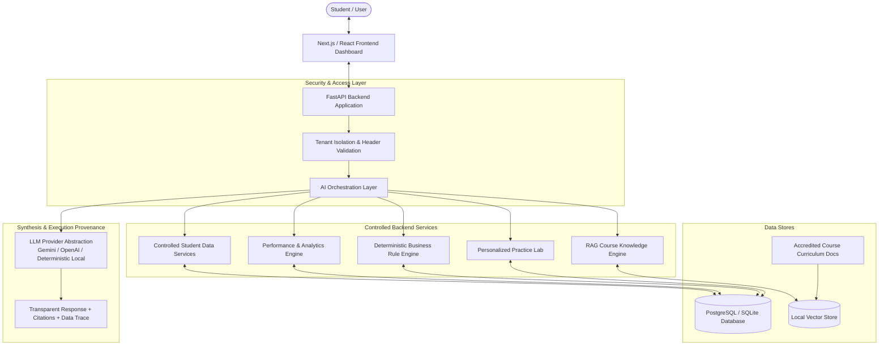

# System Architecture — AI College Learning Assistant

## 1. Architectural Overview

The **AI College Learning Assistant** is built around a strict architectural separation of concerns between **Structured Student Data**, **Grounded Course Knowledge (RAG)**, **Deterministic Business Logic**, and **AI Orchestration**.

The LLM is never given unrestricted access to the database or allowed to invent business rules. Instead, every academic query passes through a multi-stage intent router and controlled service layer.

---

## 2. Component Breakdown

### 2.1 Frontend (Next.js / React + Tailwind CSS)
- **Role**: Presents an interactive, role-based dashboard for college students.
- **Key Tabs**:
  1. **Dashboard**: Greeting, enrolled courses progress bars, KPI summary cards, weak topics chips, recommended next action.
  2. **AI Assistant**: Conversational chat interface with quick suggested prompts, source attribution pills, and an expandable AI Response Transparency drawer.
  3. **Performance**: Topic-level accuracy table, question difficulty distribution, Engagement vs Performance diagnostic quadrant, and the derived 0–100 Learning Efficiency Score.
  4. **Practice**: Interactive personalized quiz lab with instant deterministic grading, answer review, explanations, and curriculum citations.
  5. **Assessments**: Catalog of active and benchmark hackathons with instant eligibility checking (displaying the 4-rule checklist `[✓/✗]`).
  6. **Study Coach**: Personalized roadmap highlighting the immediate priority topic with factual reasons, recommended actions, and practice goals.
- **Student Switcher**: Seamlessly toggles between verified multi-modal student personas (e.g., Aarav Sharma, Priya Patel, Rohan Verma, Ananya Reddy).

### 2.2 API Layer (FastAPI)
- **Role**: High-performance asynchronous backend providing REST endpoints under `/api/v1`.
- **Tenant Isolation**: Validates student identity via `X-Student-Id` header, enforcing strict ownership boundaries. A student can only view their own courses, assessments, and progress records.
- **Lifespan Initialization**: Automatically initializes database tables and verifies vector store embedding caches upon startup.

### 2.3 Controlled Data Services
- **`student_service`**: Parameterized queries retrieving student profiles, course enrollments, granular engagement (views, MCQs, resource clicks), and historical attempts. No raw SQL is ever exposed.
- **`performance_service`**: Computes deterministic metrics:
  $$\text{Accuracy} = \frac{\sum \text{Score Obtained}}{\sum \text{Maximum Score}} \times 100\%$$
  $$\text{Weak Topic} \iff (\text{Accuracy} < 60\%) \lor (\text{Fail Count} \ge 2)$$
- **`study_coach_service`**: Formulates factual, non-fabricated study priorities and actionable next steps.

### 2.4 Deterministic Business Rule Engine
- **`rule_engine`**: Evaluates formal institutional constraints:
  1. **Assessment Active Status**: Verifies `is_active == True`.
  2. **Prerequisite Course Completion**: Verifies prerequisite course progress $\ge 80\%$ or certificate issuance.
  3. **Prerequisite Assessment Passed**: Verifies passing record on prerequisite hackathon.
  4. **Maximum Attempt Limit**: Enforces that prior attempts do not exceed `max_attempts`.
- Returns structured evaluation with `eligible: bool`, `requirements: list`, `failed_requirements: list`, and `reasons: list`. The LLM can explain the outcome but cannot override it.

### 2.5 RAG Pipeline & Knowledge Base
- **Documents**: Markdown curriculum documents for core disciplines:
  - Database Management Systems (Normalization 1NF/2NF/3NF/BCNF, ACID properties, Joins, Transactions)
  - Python Programming (Syntax, Mutability, OOP, Generators, Scope)
  - Quantitative Aptitude (Profit and Loss, Percentages, Time and Work, Number Systems, HCF/LCM, Alligation and Mixture, Interest)
  - Microprocessors & Microcontrollers (8086 architecture, memory segmentation, 8255 PPI interfacing)
  - Web Development & Frameworks (ReactJS Virtual DOM, Hooks, Flexbox vs Grid, REST)
- **Chunking**: Preserves structural metadata (`course`, `domain`, `sub_domain`, `topic`, `section`, `source`).
- **Vector Store**: Semantic embeddings using `all-MiniLM-L6-v2` with cosine similarity retrieval and metadata filtering to eliminate irrelevant cross-course drift.
- **Hallucination Refusal Guardrail**: Queries with similarity below threshold return: *"I couldn't find sufficient information in the available course material."*

### 2.6 AI Orchestrator & Conversational Memory
- **Intent Router**: Classifies queries into `weak_topics`, `course_concept`, `assessment_eligibility`, `practice_questions`, `course_progress`, `study_coach`, `performance`, or `unsupported_policy`.
- **Conversational Memory**: Resolves multi-turn follow-up pronouns (e.g. "Explain the first one", "Give me 5 questions on it") to the active topic in context.
- **Response Transparency**: Emits execution provenance tracking:
  $$\text{Query} \to \text{Intent} \to \text{Tools Invoked} \to \text{DB Results} \to \text{RAG Context} \to \text{Response}$$

---

## 3. Technology Choices & Justification

| Technology | Selection | Engineering Justification |
| :--- | :--- | :--- |
| **Backend Framework** | **FastAPI (Python 3.11)** | High-throughput async performance, automatic OpenAPI documentation, strict Pydantic v2 data validation, and native compatibility with PyTorch/SentenceTransformers. |
| **Relational Database** | **PostgreSQL / SQLite Dual Engine** | First-class PostgreSQL DDL schema with foreign keys, constraints, and analytical indexes; instant zero-configuration local SQLite fallback (`college_ai.db`) for immediate offline demonstration and testing. |
| **Vector Store** | **Local Vector Store (NumPy + JSON cache)** | Lightweight, zero-external-dependency vector indexing with cosine similarity search and metadata filtering. Avoids heavyweight vector database servers while delivering sub-millisecond retrieval on curriculum chunks. |
| **Embedding Model** | **SentenceTransformers (`all-MiniLM-L6-v2`)** | 384-dimensional dense semantic embeddings running locally on CPU in milliseconds with zero API token costs and high retrieval accuracy on technical concepts. |
| **LLM Provider Layer** | **Gemini / OpenAI / Deterministic Synthesizer** | Multi-provider abstraction supporting Google Gemini (`gemini-2.5-flash`), OpenAI (`gpt-4o-mini`), and a deterministic academic synthesizer that operates 100% reliably in air-gapped or keyless environments. |
| **Frontend Framework** | **Next.js 14 / React 18 + Tailwind CSS** | Server-side rendering, component-driven UI, fast client-side navigation between tabs, and responsive layout styling. |
